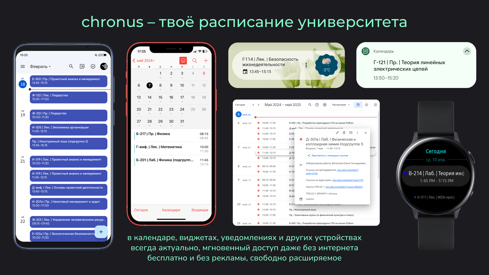

# Шаблон для создания интеграции учебного заведения с приложением chronus

О преимуществах приложения: [статья на Хабре](https://habr.com/ru/articles/888022)

Скачать приложение: [Google Play](https://play.google.com/store/apps/details?id=mxkmn.chronus)

## Смогу ли я создать интеграцию со своим учебным заведением?

Если расписание доступно на сайте учебного заведения, причём без авторизации и не в виде PDF/Excel файлов, то у вас всё получится: достаточно лишь иметь пару вечеров и минимальные знания программирования.

Если на вашем сайте используется авторизация, то вы можете помочь мне с передачей общей информации о ней [здесь](https://github.com/mxkmn/ChronusParserTemplate/issues/1).

Если с языком Kotlin, использующимся в проекте, вы не сталкивались - [посмотрите что-нибудь вроде этого](https://www.youtube.com/watch?v=30tchn0TjaM).

## Работа с проектом

1. Создайте копию этого репозитория через кнопку `Use this template` -> `Create a new repository`:

    1. Вы должны быть авторизованы на Github.

    1. Назовите `Repository name` по шаблону `ChronusParser[Ваш город][Ваш университет][Ваш институт (если требуется)]`. Для названий используйте актуальные официальные названия на русском языке, даже если по-английски аббревиатура будет иной. Например, для иркутского политеха (ИРНИТУ - Иркутский национальный исследовательский технический университет) название репозитория - `ChronusParserIrkutskIrnitu` (институт не указывается, так как все институты используют один сайт с расписанием). Или, например, для ИГУ ИМИТ (иркутский государственный университет, институт математики и информационных технологий) будет `ChronusParserIrkutskIguImit` (у этого института отдельный сайт с расписанием).

    1. Выберите видимость репозитория `Private`. Я не против, если вы хотите предоставить вашу интеграцию кому-то помимо меня, но не хотел бы, чтобы он лежал в интернете в открытом доступе - тогда вашими трудами смогут воспользоваться приложения-конкуренты, которые смогут нечестно заработать на вашей работе.

1. Откройте созданный репозиторий в IDE:
    1. Для работы можно использовать IntelliJ IDEA или Android Studio:

        * Для сборки тестового приложения для ПК (самый быстрый и простой способ) вы можете использовать [IntelliJ IDEA](https://www.jetbrains.com/idea/download/#:~:text=IntelliJ%20IDEA%20Community%20Edition%20is%20completely%20free%20to%20use) версии не ниже 2024.3.

            * После импорта проекта может понадобиться выбрать JDK, в случае использования Windows рекомендую использовать установленную вместе с IDE (`C:\Program Files\JetBrains\IntelliJ IDEA\jbr`). Для этого нужно отказаться от скачивания в диалоговом окне выбора, после выбрать путь вручную через `шестерёнку сверху справа` -> `Project Structure` -> `SDKs` -> `+` -> `Add JDK from disk`.

            * При желании собрать для Android'а потребуется установка [плагина Android](https://plugins.jetbrains.com/plugin/22989-android/versions) и некоторые настройки.

            * При желании запустить на iOS потребуется установленный Xcode и iOS Simulator (лучше не надо, оно вас сожрёт).

        * Для сборки тестового приложения для Android вы можете использовать [Android Studio](https://developer.android.com/studio) (актуальная версия с сайта, либо установленная ранее версия не ниже Ladybug 2024.2.1) - тут, в отличие от IntelliJ IDEA, настраивать под Android ничего не нужно.

            * При желании собрать для ПК/iOS потребуется установка [плагина Kotlin Multiplatform](https://plugins.jetbrains.com/plugin/14936-kotlin-multiplatform/versions/stable). Для iOS сборки также потребуется установленный Xcode и iOS Simulator (побойтесь Бога).

        * Для скачивания плагинов из IDE потребуется виртуально оказаться в другой стране (это законно, так как блокировка произошла не со стороны России). Если средства обхода блокировок не установлены, то можно поступить иначе - используя браузер с обходом блокировок, откройте JetBrains Marketplace и скачайте расширение файлом, после установите его через `шестерёнку сверху справа` -> `Plugins` -> `шестерёнка` -> `Install plugin from disk`.

    1. Клонируйте репозиторий (на компьютере должен быть установлен [Git](https://git-scm.com/downloads)) через `Clone repository` или `File` -> `New` -> `Project from Version Control`, выберите во вкладке `GitHub` свежий репозиторий.

    1. После полной загрузки попробуйте запустить приложение, выбрав сверху (чуть левее зелёного треугольника) параметр `Run on desktop`. При желании возможен запуск на устройствах Android через выбор `composeApp` (потребуется включить ADB в настройках разработчика). Запуск на iOS в теории возможен, однако не проверялся.

1. Начните написание своей интеграции:

    1. Выберите просмотр `Project` вместо `Android`

    

    1. Откройте код проекта, который находится в директории `appmodules`.

    1. В enum классе `City` (пакет `model.chronus`) измените `cyrillicName` и `timezoneId` (узнать ID часового пояса можно [здесь](https://askgeo.com/#:~:text=degrees-,TimeZoneId,-Olson%20time%20zone)). Менять название записи `YOUR_CITY` необязательно.

    1. Создайте интеграцию, воспользовавшись [отдельным гайдом](static/integration.md).

    1. Наконец, добавьте информацию о себе, модифицировав enum класс `Contributor` (пакет `model.chronus`): измените `nickName`, `photo`, `en`, `ru`. Менять название записи `YOU` необязательно.

1. Поделитесь вашим результатом:

    1. Найдите вкладку `Commit` в IDE слева, выберите все изменения и опубликуйте их, нажав на `Commit and Push`. Подтвердите проверки.

    1. Откройте ваш репозиторий на GitHub и проверьте, что изменения опубликовались.

    1. Если ваш репозиторий приватный, в репозитории на GitHub зайдите в `Settings` -> `Collaborators`, нажмите на `Add people` и добавьте меня (`mxkmn`).

    1. Сообщите об окончании разработки, написав мне в телеграм ([@mxkmn](https://t.me/mxkmn)) или на почту (mxkmn.inc@gmail.com), либо создав issue со ссылкой на ваш репозиторий.
