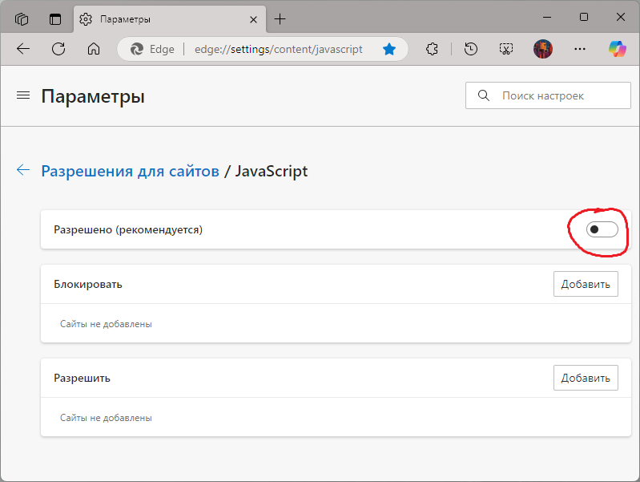
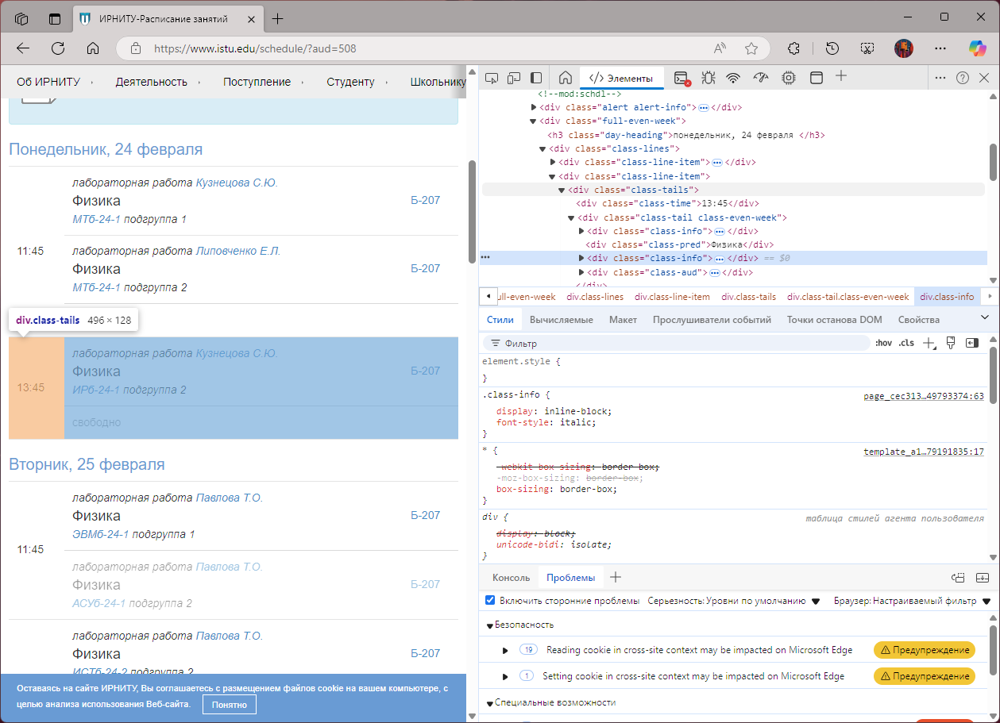
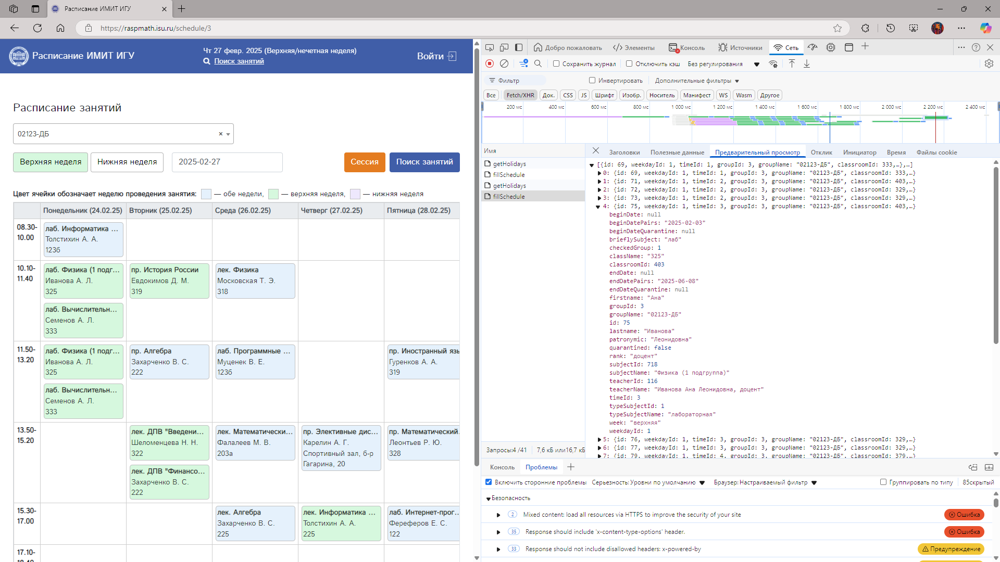

# Написание интеграции с учебным заведением

## Выбор источника расписания

<b>Основные ценности chronus</b>

При выборе источника расписания следует преследовать эти цели:

* **Предоставление максимально актуального расписания**. Если есть несколько источников расписаний, но в некоторых из них расписание постоянно устаревшее, то источники с устаревшим расписанием стоит бойкотировать.
* **Максимальный охват полезных расписаний**. Расписание групп, преподавателей, аудиторий окажется полезным для пользователей и стоит добавить их все при наличии такой возможности, а вот расписание дисциплин, например, лучше проигнорировать.
* **Авторизация нежелательна**. Во-первых, сейчас она не поддерживается. Во-вторых, даже если и будет поддерживаться, не каждый пользователь захочет вводить свои данные в стороннее приложение.

<b>Доступность информации</b>

Выбирая источник расписания, вы должны быть уверены в том, что он доступен вам. Возможны эти варианты:

1. Данные доступны любому пользователю интернета, без авторизации или после её осуществления. Например, сайты ВУЗов можно спокойно использовать.
1. API является общедоступным (это где-то указано напрямую, либо эта информация получена от автора в переписке). В этом случае может потребоваться указать его название и добавить ссылку в `Place.apiCredits` (пакет `model.chronus`).
1. API не общедоступен. В этом случае вам необходимо удостовериться, что автор этого API разрешил вам использование его интеллектуальной собственности и внедрение в стороннее приложение.

Получение данных из PDF/Excel файлов, VK/TG ботов не поддерживается (и не планируется). Если вы готовы поддержать такой набор данных для своего учебного заведения и править возможные ошибки при их возникновении в течение длительного времени - создайте свой бекенд и подключите его к chronus. Рекомендуется использовать для передачи данных модели, копирующие `Schedule` и `Lesson` (пакет `model.chronus`).

<b>Исследуем доступные источники расписания</b>

Иногда можно встретиться с разными источниками, в которых можно получить расписание. Например, для моего учебного заведения выбор был следующим:

* Сайт ВУЗа:
  * [+] Предоставляет расписание для любой группы, преподавателя или аудитории
  * [+] Расписание всегда актуально
  * [+] Не требуется авторизация
  * [-] Немного тормозной
  * [-] Нет API, поэтому придётся парсить HTML, и нет гарантий что сайт не поменяется (придётся дорабатывать парсер)

* Кампус (микросоцсеть для студентов и сотрудников):
  * [-] Только личное расписание
  * [---] Расписание иногда отсутствует
  * [---] Требуется авторизация
  * [-] Прилично тормозной
  * [-] Нет API, поэтому придётся парсить HTML, и нет гарантий что сайт не поменяется (придётся дорабатывать парсер)

* Бекенд приложения-конкурента №1:
  * [+-] Предоставляет расписание для группы или преподавателя, но не для аудитории
  * [---] Расписание редко обновляется, поэтому почти всегда устаревшее
  * [+] Не требуется авторизация
  * [+-] API не является публичным, возможно не получится договориться о легальном использовании
  * [---] Создан студентом, который не развивает приложение: велик шанс отключения серверов

* Бекенд приложения-конкурента №2:
  * Плюсы и минусы полностью идентичны приложению-конкуренту №1
  * [-] Но ещё и API максимально непродуманное: требует отдельного запроса на каждый день, следовательно, для получения расписания на 2 недели придётся сделать аж 35 запросов к серверу

* Телеграм-бот:
  * Те же (устаревшие) данные, что у приложения-конкурента №2 (так как используется тот же сервер данных)
  * [---] chronus не поддерживает парсинг из Telegram

Как можно заметить, наилучший выбор в моём случае - сайт ВУЗа. Единственная проблема - отсутствие API и необходимость парсить HTML - это несколько сложнее, плюс нет гарантий, что сайт всегда будет оставаться таким же и не потребует изменений. Тем не менее, этот сайт не менялся за последние 5 лет, поэтому парсинг остаётся стабильным.

В вашем случае также можно встретиться со множеством источников расписаний, но в большинстве случаев лучше всего подойдёт сайт (разумеется, если там данные не в виде PDF/Excel). Начинайте изучение с него - скорее всего это наилучший источник, другие не понадобятся.

## Получение данных из источника

<b>Типы передачи данных</b>

Если мы не используем источник с API и вместо этого пользуемся сайтом учебного заведения, то необходимо разобраться, как происходит передача данных через сайт.

Начнём с отображения расписания. Войдите на страницу с любым расписанием. Требуется разобраться, как именно оно передаётся.

Отключите JavaScript в браузере - для этого войдите в его настройки, введите в поиске `JavaScript`, отключите его.

После перезагрузите изначальную страницу с расписанием. Видно ли расписание после отключения JavaScript? Тогда оно передаётся прямо в HTML - в дальнейшем будем анализировать его.

Если расписание не отобразилось, то мы видим не обычную веб-страницу, а веб-приложение, которое получает данные после дополнительного запроса к серверу. Нужно анализировать запросы - читайте об этом ниже.

<b>Анализ страницы при передаче данных в HTML</b>

HTML - это структура данных с иерархической структурой, то есть внутри элементов могут находиться другие вложенные элементы.

Чтобы проанализировать передаваемые данные, достаточно в браузере нажать по элементу расписания правой кнопкой мыши и выбрать "Посмотреть код элемента" или "Проверить". Будет показано дерево элементов, с которыми нам предстоит работать.

В этой структуре требуется понять, какие данные нам понадобятся - мы их будем получать в дальнейшем при помощи Ksoup.

Пример обработки таких данных можно увидеть в файлах `IguimitGetSearchResults` (пакет `datasource.network.chronus.irkutsk-igu-imit`), `IrnituGetSearchResults` и `IrnituGetLessons` (пакет `datasource.network.chronus.irkutsk-irnitu`).

<b>Анализ страницы при передаче данных в отдельных запросах</b>

Обычно с отдельными запросами гораздо удобнее работать, но чуть сложнее разобраться в том, как их правильно составить.

Итак, необходимо открыть Инструменты разработчика во вкладке Сеть. После перезагрузки страницы появятся запросы (скорее всего во вкладке Fetch/XHR):

После выбора нужного запроса (в нашем случае `fillSchedule`) появится вся информация: в Заголовках и Полезных данных будет информация, переданная серверу, а в Предварительном просмотре - полученная информация.

Необходимо проанализировать, какая нагрузка важна, а какая является мусорной.

На примере взято получение данных расписания ИГУ ИМИТ, реализацию которого можно просмотреть в файле `IguimitGetLessons` (пакет `datasource.network.chronus.irkutsk-igu-imit`). Здесь в Полезных данных (это `body`) обнаружится строка `groupId=3` - однозначно полезно, это ID группы, которую мы просматриваем. Однако этого будет недостаточно - на самом деле сервер также требует `content-type`, который необходимо скопировать из Заголовков - после этого сервер начнёт отдавать полезную информацию.

Полезная информация почти наверняка придёт в виде JSON - её мы будем обрабатывать при помощи `kotlinx.serialization`.

<b>Работа с поиском</b>

Источники расписаний обычно предоставляют информацию о доступных группах, преподавателях, аудиториях в двух видах:

* **Набор доступных расписаний**: где-то находится полный набор всех возможных расписаний, нужно просто единоразово достать оттуда данные. Пример - `IguimitGetSearchResults`, который вытаскивает эти данные из пары HTML-страниц.
* **Реальный поиск**: требуется ввести название, отправить её на сервер, и он вернёт расписания, удовлетворяющие запросу. Пример - `IrnituGetSearchResults`. На самом деле у ИРНИТУ тоже есть страницы с наборами доступных расписаний, но их очень много и там лишь расписание групп - гораздо лучше воспользоваться поиском по всей базе.

При реальном поиске может потребоваться:

* **GET-запрос**: требуется добавить искомое название в `URL`, после пропарсить полученную HTML-страницу
* **POST-запрос**: требуется добавить искомое название в `body` или `header`, после разобрать полученный ответ (скорее всего в виде JSON). Здесь помогут разобраться Инструменты разработчика, как уже было описано выше в "Анализе страницы при передаче данных в отдельных запросах".

## Добавление интеграции в chronus

<b>Внутренняя структура chronus</b>

Вернёмся к коду.

Пора изменить запись `Place.YOUR_PLACE` (пакет `model.chronus`):

* В `cyrillicName` добавьте отображаемое название учебного заведения (а также института, если требуется)
* В `defaultUrl` укажите базовую ссылку до вашего источника расписания (префикс, используемый для всех запросов)
* В `minSearchChars` укажите `null`, если для поиска будет использоваться "Набор доступных расписаний", либо укажите минимальное количество символов для работы поиска, если используется "Реальный поиск" (при указании `null` запрос будет происходить мгновенно, и на основе полученных результатов приложение будет искать расписания без обращений к серверу)
* В `searchType` укажите доступные типы расписаний (все возможные типы перечислены в файле `SearchType` из пакета `model.chronus`)
* В `apiCredits` укажите название и ссылку на API, если требуется (читайте "Доступность информации"), или `null`, если это не требуется.
* По необходимости измените количество минут на занятие в `lessonDurationInMinutes`

Важно! Если требуется использовать расписание по ссылке с http (не http**s**) и запускать приложение на Android, то добавьте сайт в файл `permitted_http_connections.xml`, находящийся в `res/xml` модуля `app.chronusparsers.android`.

После останется написать обработчики данных вашего учебного заведения. Они находятся в пакете `datasource.network.chronus.yourcity-youruniversity`. Вам необходимо реализовать две функции: `getSearchResults` и `getLessons`.

`getSearchResults`:

* Нужна для поиска, возвращает список расписаний `List<Schedule>`
* Если `minSearchChars == null`, функция должна возвращать весь список доступных расписаний, введённые в поисковую строку данные ей не передаются
* Если `minSearchChars != null`, функция должна отправлять строку из поисковой строки на сервер и возвращать список расписаний, удовлетворяющий запросу
* В структуре данных `Schedule` в строке `url` необходимо поместить полный адрес, по которому можно посмотреть расписание через браузер. Но, если там какой-то уникальный ID, который нельзя связать с url, то можно передать в `url` строку `Place.IRKUTSK_IGU_IMIT.defaultUrl + scheduleId` - наличие defaultUrl обязательно, её потом можно будет отрезать в `getLessons`, чтобы получить `scheduleId` обратно.

`getLessons`:

* Нужна для получения конкретного расписания, выдаёт список занятий `List<Lesson>`
* Если структура данных `Lesson` не содержит каких-то важных данных, которые передаются вашим источником, то их можно передать в `additionalInfo` в виде человекочитаемой строки (пример есть в `IguimitGetLessons`).

Возникновение ошибок:

* `getSearchResults` и `getLessons` могут выдавать `null` при возникновении ошибки
* Ошибка не должна произойти, если поисковый запрос не содержит расписаний, удовлетворяющих запросу - в этом случае необходимо вернуть пустой `List`
* Аналогично, если занятий нет (на одной неделе, нескольких или сразу всех), то нужно выдавать пустой `List`
* Если сервер выбрасывает ошибки даже при правильно сформированных запросах (например, выдаёт 404 при отсутствии расписания на неделе), то вы должны нормально это обрабатывать - поскольку это ожидаемое поведение сервера, вы должны просто проигнорировать такой ответ, и даже если сервер выдал только 404-ые, выдать не null, а пустой `List`
* Важно: полностью рабочая интеграция не должна выдавать ни одной ошибки, они могут происходить только в исключительных случаях, то есть если HTML/API изменился и парсер сломался, либо если нет интернета

<b>Получение данных</b>

Получение данных происходит в первом блоке try-catch - там требуется получить ответ сервера при помощи [Ktor Client](https://ktor.io/docs/client-requests.html). Полученные данные будут переданы второму блоку try-catch. Можно пользоваться примерами из соседних пакетов `irkutsk-igu-imit` и `irkutsk-irnitu`.

В случае работы с расписанием, идеально, когда вы получаете информацию на текущую неделю, две предыдущие и две следующие. Итого, у пользователя будет до 5 учебных недель в календаре, чего более чем достаточно. Если сервер не предоставляет такое количество информации, требуется отобразить лишь доступную информацию. Например, если сайт предоставляет расписание только для чётной и нечётной группы, следует добавить расписание только на текущую и следующую недели - в остальные недели расписание может быть иным, мы не должны отображать потенциально неверное расписание.

<b>Обработка данных</b>

Обработка данных происходит во втором блоке try-catch - там требуется обработать информацию при помощи `Ksoup` для HTML (используется синтаксис [Jsoup](https://jsoup.org)) или `kotlinx.serialization` для JSON, [XML, CBOR или ProtoBuf](https://ktor.io/docs/client-serialization.html#serialization_dependency). Можно пользоваться примерами из соседних пакетов `irkutsk-igu-imit` и `irkutsk-irnitu`.

Для работы со временем используется [`kotlinx.datetime`](https://github.com/Kotlin/kotlinx-datetime/blob/master/README.md).

На этом этапе ошибки могут произойти только в случае, если сервер возвращает неожиданный результат, который убивает ваш парсер. Это может произойти только спустя длительное время, если данные на сервере станут приходить в другом виде - ни одной ошибки не должно происходить на этапе тестирования вашего парсера.

Парсеры должны быть написаны таким образом, чтобы максимально предотвращать ошибки при неожиданном ответе. Например, если сервер не прислал имя преподавателя, то идеально просто его не добавлять в Lesson. Если из-за отсутствующего имени преподавателя не формируется целое занятие и оно не будет показано пользователю, то это очень плохо, это необходимо исправлять. Если из-за отсутствующего имени преподавателя ломается парсинг и выдаётся ошибка (`null`), то это тоже очень плохо.

<b>Тестирование интеграции</b>

1. Протестируйте полученную интеграцию автоматически: найдите через поиск максимальное количество расписаний и нажмите на `Найти проблемы`. Прогресс отобразится в приложении, по необходимости его можно скопировать из IDE в панели Run (ПК/iOS) или LogCat (Android). Исправьте найденные ошибки обработки данных (пакет `datasource.network.chronus.yourcity-youruniversity`) и расширьте `LessonType` (пакет `model.chronus`).
1. Протестируйте полученную интеграцию вручную: для хорошего результата стоит проверить 7-15 расписаний **каждого** типа (групп, преподавателей, аудиторий). Тщательно сверьте наличие всех данных с данными, отображающимися на сайте.

---

После реализации интеграции вернитесь к чтению README. Осталось совсем немного!
